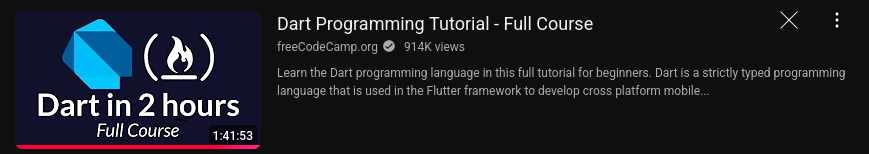

**Learn Dart: Video Notes**
==========================

**Video Title:** [Insert video title]
**Video Link:** https://www.youtube.com/watch?v=Ej_Pcr4uC2Q&t=3367s
**Time Stamp:** 1 hour 41 minutes

**What is Learned:**
--------------------

This video covers the basics of the Dart programming language. The following topics are discussed:

### Variables and Data Types

* Introduction to variables in Dart
* Basic data types: `int`, `double`, `String`, `bool`
* Type inference and explicit type declaration
* Null safety and the `?` operator

### Control Flow

* Conditional statements: `if`, `else if`, `else`
* Loops: `for`, `while`, `do-while`
* Break and continue statements

### Functions

* Function declaration and function calls
* Function parameters and return types
* Optional and named parameters

### Classes and Objects

* Introduction to classes and objects in Dart
* Constructors and instance variables
* Methods and properties

### Input/Output

* Reading input from the user using `stdin`
* Printing output to the console using `print` and `stdout.writeln`

### Game Development

* Building a simple number guessing game using Dart
* Using conditional statements and loops to control game logic

**Example Code:**
----------------

The example codes for these topics can be found in the `basic_syntax.dart` file.